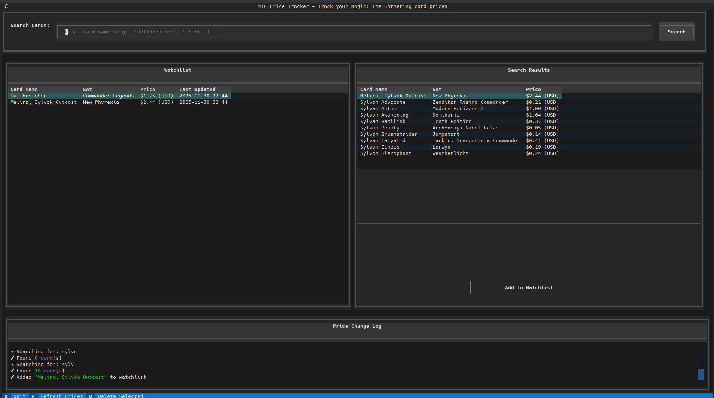

# MTG Price Tracker

A Terminal User Interface (TUI) application for tracking Magic: The Gathering card prices using the Scryfall API.

## Features

- 🔍 **Card Search**: Search for MTG cards by name with fuzzy matching
- 📋 **Watchlist**: Maintain a list of cards you want to track
- 💰 **Price Tracking**: Automatically check and update prices from Scryfall
- 📊 **Price History**: Track price changes over time and see what changed since last app start
- 💾 **Local Storage**: All data stored locally in SQLite database

## Screenshot



*The main interface showing the watchlist on the left, search results on the right, and price change log at the bottom*

## Installation

### Option 1: Download Pre-built Executable (Easiest)

Download the latest release for your platform from the [Releases page](../../releases):
- **Linux**: Download `mtg_price_tracker-linux`, make it executable, and run
- **Windows**: Download `mtg_price_tracker-windows.exe` and run

No Python installation required!

### Option 2: Run from Source

1. Make sure you have Python 3.8+ installed
2. Install dependencies:

```bash
pip install -r requirements.txt
```

## Usage

Run the application:

```bash
python3 main.py
```

### Controls

- **Search**: Type a card name in the search box and press Enter or click "Search"
- **Add to Watchlist**: Select a card from search results and click "Add to Watchlist"
- **Delete from Watchlist**: Select a card in the watchlist and press `D`
- **Refresh Prices**: Press `R` to manually refresh all prices
- **Quit**: Press `Q` to exit the application

### Features Explained

#### Search
- **Narrow searches** (e.g., "Hullbreacher"): Shows the specific card
- **Broad searches** (e.g., "Teferi"): Shows up to 10 matching cards

#### Price Tracking
- Prices are checked automatically when the app starts
- The log shows which cards have changed price since the last time you ran the app
- Prices display in USD (or EUR if USD not available)
- Price changes show percentage and direction (↑/↓)

#### Watchlist
- Add any card from search results
- View current price, set, and last update time
- Remove cards you no longer want to track

## Project Structure

```
mtg_price_tracker/
├── main.py                 # Application entry point
├── requirements.txt        # Python dependencies
├── README.md              # This file
├── data/
│   └── cards.db           # SQLite database (created automatically)
├── api/
│   ├── __init__.py
│   └── scryfall.py        # Scryfall API integration
├── database/
│   ├── __init__.py
│   └── db.py              # Database operations
├── ui/
│   ├── __init__.py
│   └── app.py             # Textual UI application
└── utils/
    ├── __init__.py
    └── price_checker.py   # Price checking logic
```

## Database

The app uses SQLite to store:
- **Watchlist**: Cards you're tracking with current prices
- **Price History**: Historical price data for each card
- **App Metadata**: Last price check time

Database file is created automatically at `data/cards.db`.

## API

This app uses the [Scryfall API](https://scryfall.com/docs/api) to fetch card data and prices. The API is free and does not require authentication.

## License

This project is for personal use. Magic: The Gathering is © Wizards of the Coast.
